# Database schema

Generated from `shared/database/schema.py`. Do not edit this file directly.

Regenerate: `python sandbox-data/manage.py schema-docs`.

Change workflow: [database-workflow.md](database-workflow.md).

## Relationships

```mermaid
erDiagram
    database_backfill_runs {
        String name PK
    }
    database_migration_checksums {
        String revision PK
    }
    payers {
        Uuid payer_id PK
    }
    sandbox_daily_runs {
        String generator PK
        Date simulation_date PK
    }
    sandbox_generator_runs {
        String name PK
    }
    sandbox_schema_migrations {
        String name PK
    }
    states {
        String state PK
    }
    portfolios {
        Uuid portfolio_id PK
    }
    states ||--o{ portfolios : "state"
    regions {
        Uuid region_id PK
    }
    portfolios ||--o{ regions : "portfolio_id"
    facilities {
        Uuid facility_id PK
    }
    regions ||--o{ facilities : "region_id"
    referring_hospitals {
        String hospital PK
    }
    regions ||--o{ referring_hospitals : "region_id"
    adt_daily_census {
        Uuid facility_id PK
        Date census_date PK
    }
    facilities ||--o{ adt_daily_census : "facility_id"
    daily_admission_facts {
        Date summary_date PK
        Uuid facility_id PK
        Uuid payer_id PK
        String source_type PK
        String source_name PK
    }
    facilities ||--o{ daily_admission_facts : "facility_id"
    payers ||--o{ daily_admission_facts : "payer_id"
    daily_discharge_facts {
        Date summary_date PK
        Uuid facility_id PK
        Uuid payer_id PK
        String destination_type PK
        String destination_name PK
    }
    facilities ||--o{ daily_discharge_facts : "facility_id"
    payers ||--o{ daily_discharge_facts : "payer_id"
    daily_payer_census_facts {
        Date summary_date PK
        Uuid facility_id PK
        String payer_type PK
    }
    facilities ||--o{ daily_payer_census_facts : "facility_id"
    daily_payer_change_facts {
        Date summary_date PK
        Uuid facility_id PK
        String previous_payer_type PK
        String new_payer_type PK
    }
    facilities ||--o{ daily_payer_change_facts : "facility_id"
    monthly_payer_census_facts {
        Date month_start PK
        Uuid facility_id PK
        String payer_type PK
    }
    facilities ||--o{ monthly_payer_census_facts : "facility_id"
    monthly_referral_facts {
        Date month_start PK
        String hospital PK
        Uuid facility_id PK
        String payer_type PK
    }
    facilities ||--o{ monthly_referral_facts : "facility_id"
    referring_hospitals ||--o{ monthly_referral_facts : "hospital"
    residents {
        Uuid resident_id PK
    }
    facilities ||--o{ residents : "facility_id"
    res_stays {
        Uuid stay_id PK
    }
    facilities ||--o{ res_stays : "facility_id"
    residents ||--o{ res_stays : "resident_id"
    sandbox_adt_residents {
        Uuid resident_id PK
    }
    residents ||--o| sandbox_adt_residents : "resident_id"
    admission_logs {
        Uuid stay_id PK
    }
    payers ||--o{ admission_logs : "payer_id"
    res_stays ||--o| admission_logs : "stay_id"
    discharge_logs {
        Uuid stay_id PK
    }
    payers ||--o{ discharge_logs : "payer_id"
    res_stays ||--o| discharge_logs : "stay_id"
    res_payer_stays {
        Uuid payer_stay_id PK
    }
    payers ||--o{ res_payer_stays : "payer_id"
    res_stays ||--o{ res_payer_stays : "stay_id"
    sandbox_adt_active_stays {
        Uuid stay_id PK
    }
    res_stays ||--o| sandbox_adt_active_stays : "stay_id"
    medicaid_applications {
        Uuid stay_id PK
    }
    payers ||--o{ medicaid_applications : "approved_payer_id"
    res_payer_stays ||--o| medicaid_applications : "payer_stay_id"
    res_stays ||--o| medicaid_applications : "stay_id"
    payer_change_logs {
        Uuid payer_stay_id PK
    }
    facilities ||--o{ payer_change_logs : "facility_id"
    payers ||--o{ payer_change_logs : "previous_payer_id"
    payers ||--o{ payer_change_logs : "new_payer_id"
    res_payer_stays ||--o| payer_change_logs : "payer_stay_id"
    res_stays ||--o{ payer_change_logs : "stay_id"
    residents ||--o{ payer_change_logs : "resident_id"
```

## database_backfill_runs

Immutable job identity, durable batch checkpoint and cumulative progress per database.

| Column | PostgreSQL type | Nullable | Key / reference | Default | Meaning |
| --- | --- | --- | --- | --- | --- |
| name | VARCHAR | no | PK |  |  |
| checksum | VARCHAR(64) | no |  |  |  |
| status | VARCHAR | no |  |  |  |
| checkpoint | JSONB | no |  |  | Job-owned JSON cursor/watermark committed atomically with each batch. |
| processed | INTEGER | no |  | 0 |  |
| changed | INTEGER | no |  | 0 |  |
| updated_at | TIMESTAMP WITH TIME ZONE | no |  | now() |  |

- CHECK: `processed >= 0 AND changed >= 0`
- CHECK: `status IN ('pending', 'running', 'deferred', 'complete')`

## database_migration_checksums

Checksums of applied Alembic revisions and their frozen artifacts.

| Column | PostgreSQL type | Nullable | Key / reference | Default | Meaning |
| --- | --- | --- | --- | --- | --- |
| revision | VARCHAR(64) | no | PK |  |  |
| checksum | VARCHAR(64) | no |  |  |  |
| applied_at | TIMESTAMP WITH TIME ZONE | no |  | now() |  |

## payers

Payer catalog. Skilled classification applies to Medicare categories and VA.

| Column | PostgreSQL type | Nullable | Key / reference | Default | Meaning |
| --- | --- | --- | --- | --- | --- |
| payer_id | UUID | no | PK |  |  |
| payer_type | VARCHAR | no |  |  |  |
| payer_name | VARCHAR | no |  |  |  |
| is_skilled | BOOLEAN | no |  |  |  |

- INDEX `ix_payers_payer_type`: payer_type
- UNIQUE: `payer_type, payer_name`

## sandbox_daily_runs

Committed generator/day checkpoints; independent of schema and backfill versions.

| Column | PostgreSQL type | Nullable | Key / reference | Default | Meaning |
| --- | --- | --- | --- | --- | --- |
| generator | VARCHAR | no | PK |  |  |
| simulation_date | DATE | no | PK |  |  |
| row_counts | JSON | no |  |  |  |
| completed_at | TIMESTAMP WITH TIME ZONE | no |  | now() |  |

## sandbox_generator_runs

Reference-generator completion records used to retain existing data.

| Column | PostgreSQL type | Nullable | Key / reference | Default | Meaning |
| --- | --- | --- | --- | --- | --- |
| name | VARCHAR | no | PK |  |  |
| row_counts | JSON | no |  |  |  |
| completed_at | TIMESTAMP WITH TIME ZONE | no |  | now() |  |

## sandbox_schema_migrations

Preserved legacy SQL migration history; new migrations use Alembic.

| Column | PostgreSQL type | Nullable | Key / reference | Default | Meaning |
| --- | --- | --- | --- | --- | --- |
| name | VARCHAR | no | PK |  |  |
| checksum | VARCHAR(64) | no |  |  |  |
| applied_at | TIMESTAMP WITH TIME ZONE | no |  | now() |  |

## states

Top-level state codes; counts are derived from child records.

| Column | PostgreSQL type | Nullable | Key / reference | Default | Meaning |
| --- | --- | --- | --- | --- | --- |
| state | VARCHAR(2) | no | PK |  |  |

## portfolios

Portfolios within states. Stored reference counts describe the source facility catalog.

| Column | PostgreSQL type | Nullable | Key / reference | Default | Meaning |
| --- | --- | --- | --- | --- | --- |
| portfolio_id | UUID | no | PK |  |  |
| state | VARCHAR(2) | no | FK → states.state |  |  |
| portfolio | VARCHAR | no |  |  |  |
| region_count | INTEGER | no |  |  |  |
| facility_count | INTEGER | no |  |  |  |
| total_beds | INTEGER | no |  |  |  |

- CHECK: `region_count >= 0 AND facility_count >= 0 AND total_beds >= 0`
- UNIQUE: `state, portfolio`

## regions

Regions within portfolios; facility groups used by hospital referral weighting.

| Column | PostgreSQL type | Nullable | Key / reference | Default | Meaning |
| --- | --- | --- | --- | --- | --- |
| region_id | UUID | no | PK |  |  |
| portfolio_id | UUID | no | FK → portfolios.portfolio_id |  |  |
| region | VARCHAR | no |  |  |  |
| facility_count | INTEGER | no |  |  |  |
| total_beds | INTEGER | no |  |  |  |

- CHECK: `facility_count >= 0 AND total_beds >= 0`
- UNIQUE: `portfolio_id, region`

## facilities

Facilities and their licensed/demo bed capacity.

| Column | PostgreSQL type | Nullable | Key / reference | Default | Meaning |
| --- | --- | --- | --- | --- | --- |
| facility_id | UUID | no | PK |  |  |
| region_id | UUID | no | FK → regions.region_id |  |  |
| facility | VARCHAR | no |  |  |  |
| beds | INTEGER | no |  |  |  |

- CHECK: `beds >= 0`
- UNIQUE: `region_id, facility`

## referring_hospitals

The hospitals that refer residents in, and the region each one refers into. State and portfolio are joins through regions, never stored copies.

| Column | PostgreSQL type | Nullable | Key / reference | Default | Meaning |
| --- | --- | --- | --- | --- | --- |
| hospital | VARCHAR | no | PK |  |  |
| region_id | UUID | no | FK → regions.region_id |  | The region this hospital refers into. Verified one region per hospital, so this is a fact about the hospital rather than a summary of its referrals. |

- CHECK: `length(trim(hospital)) > 0`
- INDEX `ix_referring_hospitals_region_id`: region_id

## adt_daily_census

Daily facility census: opening + admissions - discharges = closing.

| Column | PostgreSQL type | Nullable | Key / reference | Default | Meaning |
| --- | --- | --- | --- | --- | --- |
| facility_id | UUID | no | PK, FK → facilities.facility_id |  |  |
| census_date | DATE | no | PK |  |  |
| beds | INTEGER | no |  |  |  |
| opening_census | INTEGER | no |  |  |  |
| admissions | INTEGER | no |  |  |  |
| discharges | INTEGER | no |  |  |  |
| closing_census | INTEGER | no |  |  |  |

- CHECK: `beds >= 0 AND opening_census >= 0 AND admissions >= 0 AND discharges >= 0`
- CHECK: `closing_census = opening_census + admissions - discharges`
- CHECK: `closing_census BETWEEN 0 AND beds`

## daily_admission_facts

Additive daily admission measures at facility/payer/source grain. Reports group these rows; parent scopes are not stored.

| Column | PostgreSQL type | Nullable | Key / reference | Default | Meaning |
| --- | --- | --- | --- | --- | --- |
| summary_date | DATE | no | PK |  |  |
| facility_id | UUID | no | PK, FK → facilities.facility_id |  |  |
| payer_id | UUID | no | PK, FK → payers.payer_id |  |  |
| source_type | VARCHAR | no | PK |  |  |
| source_name | VARCHAR | no | PK |  | Referring source name; referring-hospital metrics count distinct names where source_type is Hospital. |
| admissions | INTEGER | no |  |  |  |
| readmissions | INTEGER | no |  |  |  |
| readmissions_30_day | INTEGER | no |  |  |  |
| medicaid_pending_admissions | INTEGER | no |  |  | Admissions that began pending Medicaid; retained after retroactive payer approval. |

- CHECK: `admissions > 0`
- CHECK: `length(trim(source_name)) > 0`
- CHECK: `medicaid_pending_admissions BETWEEN 0 AND admissions`
- CHECK: `readmissions BETWEEN 0 AND admissions`
- CHECK: `readmissions_30_day BETWEEN 0 AND readmissions`
- CHECK: `source_type IN ('Hospital', 'Skilled Nursing', 'Home', 'Rehab Facility', 'Assisted Living', 'Community')`
- INDEX `ix_daily_admission_facts_facility`: facility_id, summary_date

## daily_discharge_facts

Additive daily discharge measures at facility/payer/destination/disposition grain. Length of stay is a sum beside its count so any grouping divides correctly.

| Column | PostgreSQL type | Nullable | Key / reference | Default | Meaning |
| --- | --- | --- | --- | --- | --- |
| summary_date | DATE | no | PK |  |  |
| facility_id | UUID | no | PK, FK → facilities.facility_id |  |  |
| payer_id | UUID | no | PK, FK → payers.payer_id |  |  |
| destination_type | VARCHAR | no | PK |  |  |
| destination_name | VARCHAR | no | PK |  |  |
| discharges | INTEGER | no |  |  |  |
| ama_discharges | INTEGER | no |  |  | Discharges against medical advice among the grouped rows. Transfers and deaths need no measure: they are destination_type Hospital and Funeral Home. |
| length_of_stay_days | INTEGER | no |  |  | Summed length of stay for the grouped discharges. Divide by discharges for an average; never store the average. |

- CHECK: `ama_discharges BETWEEN 0 AND discharges`
- CHECK: `destination_type IN ('Hospital', 'Skilled Nursing', 'Home', 'Rehab Facility', 'Assisted Living', 'Community', 'Funeral Home')`
- CHECK: `discharges > 0`
- CHECK: `length(trim(destination_name)) > 0`
- CHECK: `length_of_stay_days >= discharges`
- INDEX `ix_daily_discharge_facts_facility`: facility_id, summary_date

## daily_payer_census_facts

Daily census and movement by payer type: opening + admissions + changes in - discharges - changes out = closing. Sums back to adt_daily_census.

| Column | PostgreSQL type | Nullable | Key / reference | Default | Meaning |
| --- | --- | --- | --- | --- | --- |
| summary_date | DATE | no | PK |  |  |
| facility_id | UUID | no | PK, FK → facilities.facility_id |  |  |
| payer_type | VARCHAR | no | PK |  |  |
| opening_census | SMALLINT | no |  |  |  |
| admissions | SMALLINT | no |  |  |  |
| discharges | SMALLINT | no |  |  |  |
| changes_in | SMALLINT | no |  |  |  |
| changes_out | SMALLINT | no |  |  |  |
| closing_census | SMALLINT | no |  |  |  |

- CHECK: `closing_census = opening_census + admissions + changes_in - discharges - changes_out`
- CHECK: `opening_census >= 0 AND closing_census >= 0 AND admissions >= 0 AND discharges >= 0 AND changes_in >= 0 AND changes_out >= 0`
- INDEX `ix_daily_payer_census_facts_facility`: facility_id, summary_date

## daily_payer_change_facts

Additive daily payer-change counts at facility/from-type/to-type grain. Residents affected is a distinct count and is read from res_payer_stays instead.

| Column | PostgreSQL type | Nullable | Key / reference | Default | Meaning |
| --- | --- | --- | --- | --- | --- |
| summary_date | DATE | no | PK |  |  |
| facility_id | UUID | no | PK, FK → facilities.facility_id |  |  |
| previous_payer_type | VARCHAR | no | PK |  | Payer type of the period that ended on this date. |
| new_payer_type | VARCHAR | no | PK |  | Payer type of the period that began on this date. |
| changes | INTEGER | no |  |  | Payer periods that began as a change from the previous period, at payer-type grain. A change within one payer type (plan only) has previous_payer_type = new_payer_type. |

- CHECK: `changes > 0`
- INDEX `ix_daily_payer_change_facts_facility`: facility_id, summary_date

## monthly_payer_census_facts

Calendar-month rollup of daily_payer_census_facts for monthly trending. Flows are summed; census is taken from the first and last day of each month.

| Column | PostgreSQL type | Nullable | Key / reference | Default | Meaning |
| --- | --- | --- | --- | --- | --- |
| month_start | DATE | no | PK |  |  |
| facility_id | UUID | no | PK, FK → facilities.facility_id |  |  |
| payer_type | VARCHAR | no | PK |  |  |
| opening_census | SMALLINT | no |  |  |  |
| admissions | SMALLINT | no |  |  |  |
| discharges | SMALLINT | no |  |  |  |
| changes_in | SMALLINT | no |  |  |  |
| changes_out | SMALLINT | no |  |  |  |
| closing_census | SMALLINT | no |  |  |  |

- CHECK: `closing_census = opening_census + admissions + changes_in - discharges - changes_out`
- CHECK: `date_trunc('month', month_start) = month_start`
- CHECK: `opening_census >= 0 AND closing_census >= 0 AND admissions >= 0 AND discharges >= 0 AND changes_in >= 0 AND changes_out >= 0`
- INDEX `ix_monthly_payer_census_facts_facility`: facility_id, month_start

## monthly_referral_facts

Calendar-month rollup of the hospital referrals in daily_admission_facts, at hospital/facility/payer-type grain. Flows only, so every column sums over any set of rows.

| Column | PostgreSQL type | Nullable | Key / reference | Default | Meaning |
| --- | --- | --- | --- | --- | --- |
| month_start | DATE | no | PK |  |  |
| hospital | VARCHAR | no | PK, FK → referring_hospitals.hospital |  | Referring hospital name, matching daily_admission_facts.source_name where source_type is Hospital. |
| facility_id | UUID | no | PK, FK → facilities.facility_id |  |  |
| payer_type | VARCHAR | no | PK |  | Payer type of the admissions counted. Deliberately coarser than the daily table: at payer_id grain this rollup came to 88% of its source rows. |
| admissions | SMALLINT | no |  |  | Admissions referred by this hospital into this facility on this payer type during the month. |
| readmissions | SMALLINT | no |  |  |  |
| readmissions_30_day | SMALLINT | no |  |  |  |

- CHECK: `admissions > 0`
- CHECK: `date_trunc('month', month_start) = month_start`
- CHECK: `readmissions BETWEEN 0 AND admissions`
- CHECK: `readmissions_30_day BETWEEN 0 AND readmissions`
- INDEX `ix_monthly_referral_facts_hospital`: hospital, month_start

## residents

Saved resident identities associated with a facility. Stays reference these saved IDs.

| Column | PostgreSQL type | Nullable | Key / reference | Default | Meaning |
| --- | --- | --- | --- | --- | --- |
| resident_id | UUID | no | PK |  |  |
| facility_id | UUID | no | FK → facilities.facility_id |  |  |
| gender | VARCHAR(6) | no |  |  |  |
| first_name | VARCHAR | no |  |  |  |
| last_name | VARCHAR | no |  |  |  |

- CHECK: `gender IN ('male', 'female')`
- INDEX `ix_residents_facility_id`: facility_id
- UNIQUE: `first_name, last_name; DEFERRABLE INITIALLY DEFERRED`

## res_stays

Admission-to-discharge episodes. A null discharge date means currently admitted.

| Column | PostgreSQL type | Nullable | Key / reference | Default | Meaning |
| --- | --- | --- | --- | --- | --- |
| stay_id | UUID | no | PK |  |  |
| resident_id | UUID | no | FK → residents.resident_id |  |  |
| facility_id | UUID | no | FK → facilities.facility_id |  |  |
| admission_number | INTEGER | no |  |  |  |
| admission_date | DATE | no |  |  |  |
| discharge_date | DATE | yes |  |  |  |

- CHECK: `admission_number BETWEEN 1 AND 7`
- CHECK: `discharge_date IS NULL OR discharge_date > admission_date`
- INDEX `ix_res_stays_admission_date`: admission_date
- INDEX `ix_res_stays_discharge_date`: discharge_date
- INDEX `ix_res_stays_facility_id`: facility_id
- INDEX `ix_res_stays_resident_id`: resident_id
- UNIQUE: `resident_id, admission_number`

## sandbox_adt_residents

Internal simulation state for readmissions, eligibility and cumulative skilled days.

| Column | PostgreSQL type | Nullable | Key / reference | Default | Meaning |
| --- | --- | --- | --- | --- | --- |
| resident_id | UUID | no | PK, FK → residents.resident_id |  |  |
| admission_limit | INTEGER | no |  |  |  |
| admissions | INTEGER | no |  |  |  |
| last_discharge | DATE | yes |  |  |  |
| eligible_after | DATE | yes |  |  |  |
| is_deceased | BOOLEAN | no |  |  |  |
| skilled_used | INTEGER | no |  |  |  |

- CHECK: `admission_limit BETWEEN 1 AND 7 AND admissions BETWEEN 1 AND admission_limit`
- CHECK: `skilled_used BETWEEN 0 AND 100`

## admission_logs

One actual admission event per episode, including referring source and readmission flags.

| Column | PostgreSQL type | Nullable | Key / reference | Default | Meaning |
| --- | --- | --- | --- | --- | --- |
| stay_id | UUID | no | PK, FK → res_stays.stay_id |  |  |
| admission_date | DATE | no |  |  |  |
| payer_id | UUID | no | FK → payers.payer_id |  |  |
| source_type | VARCHAR | no |  |  |  |
| source_name | VARCHAR | no |  |  |  |
| is_readmission | BOOLEAN | no |  |  | Resident has a previous admission episode. |
| is_30_day_readmission | BOOLEAN | no |  |  | Return within 30 days of the previous discharge; also a readmission. |

- CHECK: `NOT is_30_day_readmission OR is_readmission`
- CHECK: `length(trim(source_name)) > 0`
- CHECK: `source_type IN ('Hospital', 'Skilled Nursing', 'Home', 'Rehab Facility', 'Assisted Living', 'Community')`
- INDEX `ix_admission_logs_admission_date`: admission_date
- INDEX `ix_admission_logs_payer_id`: payer_id

## discharge_logs

One actual discharge event per closed episode. LOS measures the final payer period.

| Column | PostgreSQL type | Nullable | Key / reference | Default | Meaning |
| --- | --- | --- | --- | --- | --- |
| stay_id | UUID | no | PK, FK → res_stays.stay_id |  |  |
| discharge_date | DATE | no |  |  |  |
| payer_id | UUID | no | FK → payers.payer_id |  |  |
| destination_type | VARCHAR | no |  |  |  |
| destination_name | VARCHAR | no |  |  |  |
| is_deceased | BOOLEAN | no |  |  |  |
| is_ama | BOOLEAN | no |  | false | Left against medical advice. Deaths and acute transfers are already implied by destination_type, so neither is eligible and the three outcomes stay disjoint. |
| los | INTEGER | no |  |  | Discharge date minus the final payer period start date, in days; not admission LOS. |

- CHECK: `NOT (is_ama AND (is_deceased OR destination_type = 'Hospital'))`
- CHECK: `destination_type IN ('Hospital', 'Skilled Nursing', 'Home', 'Rehab Facility', 'Assisted Living', 'Community', 'Funeral Home')`
- CHECK: `is_deceased = (destination_type = 'Funeral Home')`
- CHECK: `length(trim(destination_name)) > 0`
- CHECK: `los > 0`
- INDEX `ix_discharge_logs_discharge_date`: discharge_date
- INDEX `ix_discharge_logs_payer_id`: payer_id

## res_payer_stays

Payer periods inside an admission episode. The active period has no end date.

| Column | PostgreSQL type | Nullable | Key / reference | Default | Meaning |
| --- | --- | --- | --- | --- | --- |
| payer_stay_id | UUID | no | PK |  |  |
| stay_id | UUID | no | FK → res_stays.stay_id |  |  |
| payer_id | UUID | no | FK → payers.payer_id |  |  |
| period_number | INTEGER | no |  |  |  |
| start_date | DATE | no |  |  |  |
| end_date | DATE | yes |  |  | Exclusive period end; null until payer change or discharge actually occurs. |
| start_reason | VARCHAR | no |  |  |  |
| end_reason | VARCHAR | yes |  |  |  |

- CHECK: `(end_date IS NULL AND end_reason IS NULL) OR (end_date IS NOT NULL AND end_reason IS NOT NULL AND end_reason IN ('payer_change', 'discharge'))`
- CHECK: `(period_number = 1 AND start_reason = 'admission') OR (period_number > 1 AND start_reason = 'payer_change')`
- CHECK: `end_date IS NULL OR end_date > start_date`
- CHECK: `period_number BETWEEN 1 AND 3`
- INDEX `ix_res_payer_stays_changes`: start_date, stay_id
- INDEX `ix_res_payer_stays_end_date`: end_date
- INDEX `ix_res_payer_stays_payer_id`: payer_id
- INDEX `ix_res_payer_stays_start_date`: start_date
- INDEX `ix_res_payer_stays_stay_id`: stay_id
- UNIQUE: `stay_id, period_number`

## sandbox_adt_active_stays

Internal future simulation plans. These are not completed clinical events.

| Column | PostgreSQL type | Nullable | Key / reference | Default | Meaning |
| --- | --- | --- | --- | --- | --- |
| stay_id | UUID | no | PK, FK → res_stays.stay_id |  |  |
| planned_discharge | DATE | no |  |  |  |
| payer_plan | JSONB | no |  |  |  |
| skilled_days | INTEGER | no |  |  |  |
| medicaid_approval | JSONB | yes |  |  | Private planned approval date and payer ID; not a completed approval event. |

## medicaid_applications

Admissions that started pending Medicaid. Preserves application/approval metrics after payer records are retroactively corrected.

| Column | PostgreSQL type | Nullable | Key / reference | Default | Meaning |
| --- | --- | --- | --- | --- | --- |
| stay_id | UUID | no | PK, FK → res_stays.stay_id |  |  |
| payer_stay_id | UUID | no | FK → res_payer_stays.payer_stay_id |  |  |
| application_date | DATE | no |  |  | Admission date when Medicaid coverage was pending; a row permanently identifies a pending-at-admission case. |
| approved_date | DATE | yes |  |  | Actual approval date; null while unresolved. Approved coverage is retroactive to application_date. |
| approved_payer_id | UUID | yes | FK → payers.payer_id |  |  |

- CHECK: `(approved_date IS NULL AND approved_payer_id IS NULL) OR (approved_date IS NOT NULL AND approved_payer_id IS NOT NULL AND approved_date >= application_date)`
- INDEX `ix_medicaid_applications_application_date`: application_date
- INDEX `ix_medicaid_applications_approved_date`: approved_date
- UNIQUE: `payer_stay_id`

## payer_change_logs

One row per payer change, flattened with the period it moved from. Derived from res_payer_stays to spare every report the self-join on period_number - 1.

| Column | PostgreSQL type | Nullable | Key / reference | Default | Meaning |
| --- | --- | --- | --- | --- | --- |
| payer_stay_id | UUID | no | PK, FK → res_payer_stays.payer_stay_id |  |  |
| stay_id | UUID | no | FK → res_stays.stay_id |  |  |
| resident_id | UUID | no | FK → residents.resident_id |  |  |
| facility_id | UUID | no | FK → facilities.facility_id |  |  |
| change_date | DATE | no |  |  |  |
| previous_payer_id | UUID | no | FK → payers.payer_id |  |  |
| new_payer_id | UUID | no | FK → payers.payer_id |  |  |
| previous_start_date | DATE | no |  |  |  |
| new_end_date | DATE | yes |  |  |  |
| is_type_change | BOOLEAN | no |  |  |  |

- CHECK: `change_date > previous_start_date`
- CHECK: `new_end_date IS NULL OR new_end_date > change_date`
- CHECK: `previous_payer_id <> new_payer_id`
- INDEX `ix_payer_change_logs_change_date`: change_date
- INDEX `ix_payer_change_logs_facility`: facility_id, change_date
- INDEX `ix_payer_change_logs_resident_id`: resident_id
- INDEX `ix_payer_change_logs_stay_id`: stay_id
